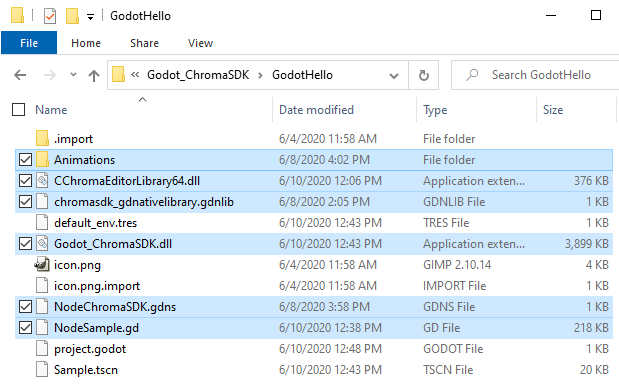

# Godot Chroma SDK Plugin

Note: The Chroma SDK for Godot plugin is for the *Windows* platform only!

**Table of Contents**

* [See Also](#see-also)
* [About](#about)
* [Quick Start](#quick-start)
* [Project Setup](#project-setup)

<a name="see-also"></a>
## See Also

**Docs:**

- [Chroma Animation Guide](http://chroma.razer.com/ChromaGuide/) - Visual examples of the Chroma Animation API methods

**Apps:**

- [ChromaClientForDiscord](https://github.com/tgraupmann/ChromaDiscordApp) - Add Chroma lighting to the Discord App events

- [ChromaClientForMixer](https://github.com/tgraupmann/ChromaClientForMixer) - Add Chroma lighting to the Mixer streaming experience

- [ChromaClientForTwitch](https://github.com/tgraupmann/ChromaTwitchExtension) - Add Chroma lighting to the Twitch streaming experience

**Plugins:**

- [CChromaEditor](https://github.com/RazerOfficial/CChromaEditor) - C++ native MFC library for playing and editing Chroma animations

- [GameMakerChromaExtension](https://github.com/RazerOfficial/GameMakerChromaExtension) - GameMaker extension to control lighting for Razer Chroma

- [Godot_ChromaSDK](https://github.com/RazerOfficial/Godot_ChromaSDK) - Godot native library for playing Chroma animations

- [HTML5ChromaSDK](https://github.com/RazerOfficial/HTML5ChromaSDK) - JavaScript library for playing Chroma animations

- [UE4_XDK_SampleApp](https://github.com/razerofficial/UE4_XDK_SampleApp) - UE4 Chroma samples and runtime module with Blueprint library for the ChromaSDK

- [UnityNativeChromaSDK](https://github.com/RazerOfficial/UnityNativeChromaSDK) - Unity native library for the ChromaSDK

<a name="about"></a>
## About

* [GodotHello](GodotHello)

The `GodotHello` project is a Godot sample app that shows the animations from the [Chroma Animation Guide](http://chroma.razer.com/ChromaGuide/).

**Screenshot:**


**Video:**

**Godot Native Plugin - Chroma SDK**

<a target="_blank" href="https://www.youtube.com/watch?v=U50sp-QumDg"></a>


## Quick Start

* Download a prebuilt binary from [releases](https://github.com/razerofficial/Godot_ChromaSDK/releases/) and place in the project folder



* `Animations` - Sample folder for `Chroma` animation files

* `CChromaEditorLibrary64.dll` - Adds `Chroma` animation support and uses the `ChromaSDK`

* `chromasdk_gdnativelibrary.gdnlib` - Native Godot library for the `ChromaSDK`

* `Godot_ChromaSDK.dll` - Native Godot library that makes the `ChromaAnimation` library available

* `NodeChromaSDK.gdns` - Godot native script connector

* `NodeSample.gd` - Sample `gdscript` that uses the `ChromaAnimation` API

## Project Setup

These are the steps to build the `Godot_ChromaSDK.dll` library.

* First generate the Godot include files

* Reference: [GDNative C++ example](https://docs.godotengine.org/en/latest/tutorials/plugins/gdnative/gdnative-cpp-example.html)

* Pick a starting point:

```
cd C:\Public
```

* Clone the Godot project (3.0 is actually the old version so get the main version)

```
mkdir gdnative_cpp_example
cd gdnative_cpp_example
git init
git submodule add https://github.com/GodotNativeTools/godot-cpp
cd godot-cpp
git submodule update --init
cd ..
```

* Update the submodules from the `gdnative_cpp_example` folder

```
git submodule update --init --recursive
```

* Download the 64-bit standard version of [Godot](https://godotengine.org/download/windows)

* Build the C++ bindings from the `gdnative_cpp_example` folder

```
"%USERPROFILE%\Downloads\Godot\Godot_v3.2.1-stable_win64.exe" --gdnative-generate-json-api api.json
```

* Install [Python 2.7 or better](https://www.python.org/)

* Install [PIP](https://pip.pypa.io/en/stable/installing/)

* Download [Scons 3.1.2](https://scons.org/tag/releases.html)

* ... or install scons with *pip*

```
c:\Python27\python.exe -m pip install scons
```

* Make sure your target *Python* version is first in the path if you have multiple versions installed.

```
SET PATH=C:\Python27;%PATH%
```

## Debug Build

* Generate the C++ bindings from the `gdnative_cpp_example` folder

```
cd godot-cpp
"%USERPROFILE%\Downloads\Godot\scons-3.1.2\script\scons.bat" platform=windows generate_bindings=yes -j4
```

* Add C++ include folders to the project

**C:\Public\gdnative_cpp_example\godot-cpp\include;C:\Public\gdnative_cpp_example\godot-cpp\include\core;C:\Public\gdnative_cpp_example\godot-cpp\godot_headers;C:\Public\gdnative_cpp_example\godot-cpp\include\gen**

* Add the godot library to the project

```
libgodot-cpp.windows.debug.default.lib
```

## Release Build

* Generate the C++ bindings from the `gdnative_cpp_example` folder

```
cd godot-cpp
"%USERPROFILE%\Downloads\Godot\scons-3.1.2\script\scons.bat" platform=windows target=release generate_bindings=yes -j4
```

* Add C++ include folders to the project

**C:\Public\gdnative_cpp_example\godot-cpp\include;C:\Public\gdnative_cpp_example\godot-cpp\include\core;C:\Public\gdnative_cpp_example\godot-cpp\godot_headers;C:\Public\gdnative_cpp_example\godot-cpp\include\gen**

* Add the godot library to the project

```
libgodot-cpp.windows.release.default.lib
```

## All

* Add to `Linker` General `Additional Library Directories`

```
C:\Public\gdnative_cpp_example\godot-cpp\bin
```
